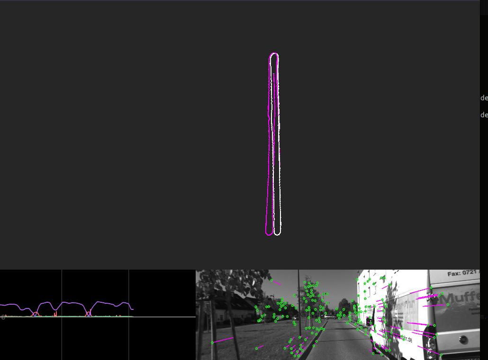

# VOpy
simple visual odometry in python

pipeline
---
 - Shi-Tomasi Corner Detection (Good Features to Track)
 - ORB Descriptor Extraction
 - Brute Force K-Nearest Neighbors Search (Feature Matching)
 - RANSAC 5-point Essential Matrix Estimation
 - Decompose Essential Matrix into a pose(Rt) matrix
 - output pose
